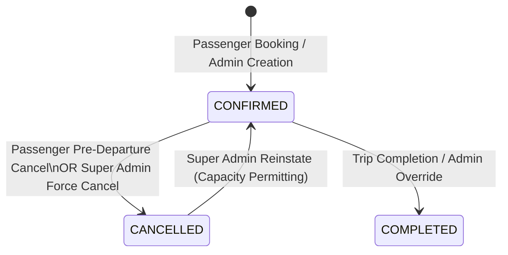
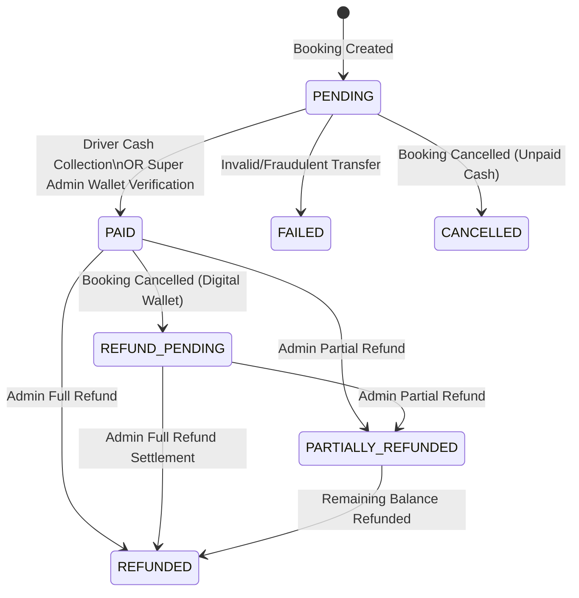
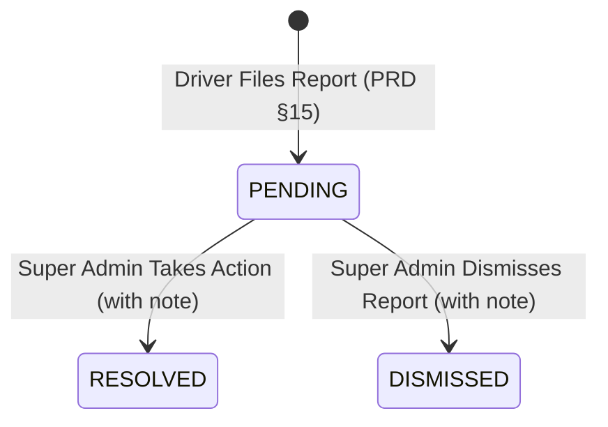

# Data Model: Super Admin Booking Review Flow

**Feature**: `005-super-admin-booking-review`  
**Date**: 2026-09-14  
**Status**: Completed  

---

## 1. Schema Extensions & Entity Definitions

### 1.1 Booking Model Modifications

The `Booking` model in `prisma/schema.prisma` is augmented with payment reconciliation and refund tracking columns.

```prisma
model Booking {
  id                  String    @id @default(uuid()) @db.Uuid
  fleetId             String    @map("fleet_id") @db.Uuid
  tripId              String    @map("trip_id") @db.Uuid
  passengerName       String    @map("passenger_name") @db.VarChar(255)
  passengerPhone      String?   @map("passenger_phone") @db.VarChar(30)
  passengerUserId     String?   @map("passenger_user_id") @db.Uuid
  seats               Int       @default(1)
  /// CONFIRMED | CANCELLED | COMPLETED (validated app-layer)
  status              String    @default("CONFIRMED") @db.VarChar(20)
  totalAmount         Decimal?  @map("total_amount") @db.Decimal(10, 2)
  confirmedAt         DateTime  @default(now()) @map("confirmed_at")
  cancelledAt         DateTime? @map("cancelled_at")
  cancelledBy         String?   @map("cancelled_by") @db.Uuid
  cancellationReason  String?   @map("cancellation_reason") @db.VarChar(500)
  createdAt           DateTime  @default(now()) @map("created_at")
  updatedAt           DateTime  @updatedAt @map("updated_at")

  // --- driver operational columns (spec 003 & 004)
  boardedAt           DateTime? @map("boarded_at")
  boardedBy           String?   @map("boarded_by") @db.Uuid
  /// DROPPED_OFF | NOT_DROPPED_OFF (terminal per booking; validated app-layer)
  dropStatus          String?   @map("drop_status") @db.VarChar(20)
  dropStationId       String?   @map("drop_station_id") @db.VarChar(100)
  dropReason          String?   @map("drop_reason") @db.VarChar(500)
  droppedAt           DateTime? @map("dropped_at")

  // --- payment lifecycle & reconciliation columns (spec 004 & 005)
  paymentMethod       String?   @map("payment_method") @db.VarChar(20)
  /// PENDING | PAID | REFUND_PENDING | PARTIALLY_REFUNDED | REFUNDED | FAILED | CANCELLED
  paymentStatus       String?   @map("payment_status") @db.VarChar(20)
  paidAt              DateTime? @map("paid_at")
  paymentMarkedBy     String?   @map("payment_marked_by") @db.Uuid
  paymentReference    String?   @map("payment_reference") @db.VarChar(100)
  refundedAmount      Decimal   @default(0) @map("refunded_amount") @db.Decimal(10, 2)
  refundReference     String?   @map("refund_reference") @db.VarChar(100)
  paymentNotes        String?   @map("payment_notes") @db.VarChar(500)

  // --- ratings & relations
  busRating           Int?      @map("bus_rating")
  driverRating        Int?      @map("driver_rating")
  passengerRating     Int?      @map("passenger_rating")
  busRatedAt          DateTime? @map("bus_rated_at")
  driverRatedAt       DateTime? @map("driver_rated_at")
  passengerRatedAt    DateTime? @map("passenger_rated_at")

  trip                Trip      @relation(fields: [tripId], references: [id])
  fleet               Fleet     @relation(fields: [fleetId], references: [id])
  passenger           User?     @relation("PassengerBookings", fields: [passengerUserId], references: [id])
  reports             PassengerReport[]
  shares              TripShare[]

  @@index([fleetId])
  @@index([tripId])
  @@index([passengerUserId])
  @@index([status])
  @@index([paymentStatus])
  @@map("bookings")
}
```

### 1.2 PassengerReport Model Modifications

The `PassengerReport` model is upgraded from a passive note into a closed-loop incident management entity with administrative resolution fields.

```prisma
model PassengerReport {
  id             String    @id @default(uuid()) @db.Uuid
  fleetId        String    @map("fleet_id") @db.Uuid
  tripId         String    @map("trip_id") @db.Uuid
  bookingId      String    @map("booking_id") @db.Uuid
  passengerId    String?   @map("passenger_id") @db.Uuid
  driverId       String    @map("driver_id") @db.Uuid
  note           String    @db.VarChar(2000)
  /// PENDING | RESOLVED | DISMISSED (validated app-layer)
  status         String    @default("PENDING") @db.VarChar(20)
  resolutionNote String?   @map("resolution_note") @db.VarChar(2000)
  resolvedAt     DateTime? @map("resolved_at")
  resolvedBy     String?   @map("resolved_by") @db.Uuid
  createdAt      DateTime  @default(now()) @map("created_at")
  updatedAt      DateTime  @default(now()) @updatedAt @map("updated_at")

  fleet   Fleet   @relation(fields: [fleetId], references: [id])
  trip    Trip    @relation(fields: [tripId], references: [id])
  booking Booking @relation(fields: [bookingId], references: [id])
  driver  User    @relation("ReportDriver", fields: [driverId], references: [id])

  @@index([fleetId])
  @@index([tripId])
  @@index([bookingId])
  @@index([status])
  @@map("passenger_reports")
}
```

---

## 2. State Machine Lifecycles

### 2.1 Booking Status Lifecycle



- **CONFIRMED**: Initial bookable reservation state.
- **CANCELLED**: Terminal for passengers; reversible by Super Admin if trip available capacity is sufficient.
- **COMPLETED**: Journey completed.

---

### 2.2 Payment Status Lifecycle



- **PENDING**: Initial payment state for both cash and offline wallets.
- **PAID**: Exact total fare collected and verified (`amount === totalAmount`).
- **FAILED**: Rejected or unverifiable payment attempt.
- **CANCELLED**: Booking cancelled before payment was ever received.
- **REFUND_PENDING**: Transition state after cancellation when passenger previously paid electronically.
- **PARTIALLY_REFUNDED**: $0 < \text{refundedAmount} < \text{totalAmount}$.
- **REFUNDED**: $\text{refundedAmount} = \text{totalAmount}$.

---

### 2.3 Passenger Incident Report Lifecycle



- **PENDING**: New report filed by driver, awaiting administrative review.
- **RESOLVED**: Administrative investigation complete, action documented in `resolutionNote`.
- **DISMISSED**: Report determined non-actionable or invalid, documented in `resolutionNote`.

---

## 3. Concurrency and Atomicity Boundaries

### 3.1 Force Cancellation with Seat Inventory Restoration

```text
Interactive Transaction (SystemPrismaService):
  1. SELECT * FROM bookings WHERE id = :bookingId FOR UPDATE
  2. Verify booking is in CONFIRMED status
  3. IF releaseSeats == true AND trip.departureTime > now():
       UPDATE trips
       SET available_seats = LEAST(bus.capacity, available_seats + booking.seats)
       WHERE id = booking.trip_id
  4. UPDATE bookings
     SET status = 'CANCELLED',
         cancelled_at = now(),
         cancelled_by = :superAdminId,
         cancellation_reason = :reason,
         payment_status = CASE
           WHEN payment_status = 'PAID' THEN 'REFUND_PENDING'
           WHEN payment_status = 'PENDING' AND payment_method = 'CASH' THEN 'CANCELLED'
           ELSE payment_status
         END
  5. INSERT INTO audit_logs (actor, action='booking.force_cancel', resourceId, metadata)
```

### 3.2 Reinstatement with Strict Capacity Check

```text
Interactive Transaction (SystemPrismaService):
  1. SELECT * FROM bookings WHERE id = :bookingId FOR UPDATE
  2. Verify booking.status == 'CANCELLED'
  3. SELECT * FROM trips WHERE id = booking.trip_id FOR UPDATE
  4. IF trip.available_seats < booking.seats:
       ABORT -> throw ConflictException('SEATS_UNAVAILABLE')
  5. UPDATE trips
     SET available_seats = available_seats - booking.seats
     WHERE id = booking.trip_id
  6. UPDATE bookings
     SET status = 'CONFIRMED',
         cancelled_at = NULL,
         cancelled_by = NULL,
         cancellation_reason = NULL
  7. INSERT INTO audit_logs (actor, action='booking.reinstate', resourceId, metadata)
```

---

## 4. Audit Log Metadata Schema

All mutations record an audit log row conforming to Constitution Principle VII:

| Field | Type | Description |
|---|---|---|
| `actor_user_id` | UUID | ID of the authenticated Super Admin |
| `action` | String | E.g. `booking.verify_payment`, `booking.refund`, `booking.force_cancel`, `booking.reinstate`, `booking.override_operational`, `report.resolve` |
| `resource` | String | Constant `'bookings'` or `'passenger_reports'` |
| `resource_id` | UUID | Target Booking ID or Report ID |
| `metadata` | JSON | Sanitized state delta (e.g. `{ oldStatus, newStatus, reference, amount, reason }`) without credentials |
| `success` | Boolean | True on success |
